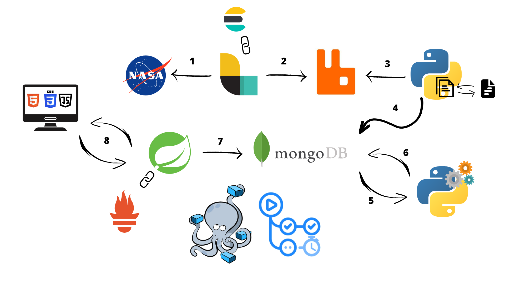

# Mars Vision: elaborazione realtime di immagini dei rover presenti su Marte
L’obiettivo di questo progetto è quello di creare uno strumento di analisi e visualizzazione di semplice utilizzo basato su una pipeline realtime di image processing robusta e resiliente in grado di applicare degli algoritmi di Machine learning e Computer vision a delle rilevazioni fotografiche  effettuate su Marte quotidianamente dai Rover Curiosity, Perseverance e Spirit  per la ricerca di informazioni di interesse. L'endpoint implementato è un'interfaccia web messa a disposizione degli utenti che potranno visualizzare le analisi effettuate in modo rapido, avendo la possibilità di confrontare più risultati contemporaneamente.

## Architettura del sistema
Il sistema è progettato per elaborare le immagini in maniera scalabile e in tempo reale. L'architettura basata sui microservizi permette di isolare e distribuire facilmente le diverse funzionalità del sistema.

L'intera infrastruttura è basata su **container Docker** e orchestrata tramite **Docker Compose**. La totalità della comunicazione avviene tramite REST api e attraverso una rete privata che connette tutti i servizi. 

 

La pipeline di elaborazione delle immagini è composta da tre fasi principali:

**Raccolta dei dati:** Logstash effettua richieste HTTP all'API della NASA per recuperare i dati sulle immagini dei rover su Marte e li scrive su una coda di messaggi RabbitMQ.

**Elaborazione delle immagini:** uno script Python legge i messaggi dalla coda RabbitMQ, effettua il preprocessing delle immagini per renderle adatte alla computazione e le scrive su una collezione MongoDB chiamata "base_image".

**Applicazione degli algoritmi:** uno script Python viene richiamato tramite una chiamata API ogni 24 dal microservizio precedente. La chiamata scatena la lettura delle immagini dalla collezione "base_image", fa partire le operazioni di processing e scrive le immagini risultanti su altre collezioni MongoDB.

Infine, l'**API RESTful Spring Boot** fornisce un'interfaccia per accedere alle immagini elaborate e visualizzarle su un sito web.

Opzionalmente a scopo di monitoring è disponibile un server **Prometheus** consultabile tramite una dashboard web che effettua il monitoring della pipeline.

## Componenti del sistema

##  LogStash
Logstash è un servizio di elaborazione dei dati che effettua richieste HTTP all'API della NASA per recuperare i dati sulle immagini dei rover su Marte. Logstash è configurato per recuperare i dati ogni 24 ore e scrive i dati JSON recuperati su una coda di messaggi RabbitMQ.

##  RabbitMQ
RabbitMQ è una coda di messaggi utilizzata per gestire la comunicazione tra i diversi servizi del sistema. Logstash scrive i dati sulla coda di messaggi e lo script Python che effettua la pre-elaborazione delle immagini legge i dati dalla coda di messaggi.

##  Preprocessing
Lo script Python di preprocessing è il primo componente di elaborazione del sistema ed è responsabile di trasformare le immmagini in un formato adatto all'elaborazione. Lo script legge i messaggi dalla coda di messaggi RabbitMQ, effettua un filtraggio delle immagini, all'occorrenza trasformandole in bianco e nero e le scrive su una collezione MongoDB chiamata "base_image".

##  Image Processing
Lo scipt di image processing fa uso di librerie come Tensorflow, Keras e SkLearn per effettuare l'elaborazione finale delle immagini, questa parte della pipeline è attivata giornalmente tramite una chiamata api effettuata dal microservizio di preprocessing al termine della sua esecuzione. Dopo questa chiamata, lo script si occupa di effettuare il pull delle immagini dal database e di applicare algoritmi di Segmentazione, Corner detection e Clustering alle immagini. I risultati finali sono memorizzati in formato Base64 all'interno di apposite collection MongoDB.

Una spiegazione più dettagliata degli algoritmi utilizzati è reperibile al seguente [link](https://github.com/Mantellinas/multimedia-project/blob/main/_media/relazione.pdf).

##  MongoDB
MongoDB è un database NoSQL utilizzato per archiviare le immagini. Le immagini vengono archiviate in diverse collezioni MongoDB: "base_image" contiene le immagini originali, mentre le immagini elaborate vengono archiviate in altre collezioni apposite.

##  SpringBoot
La REST API Spring Boot fornisce un'interfaccia RESTful per accedere alle immagini elaborate e visualizzarle su una dashboard web. L'API fornisce endpoint per recuperare le immagini elaborate e mostrarle all'utente finale.

##  Prometheus
Prometheus è un server di monitoraggio utilizzato per monitorare le prestazioni della REST API Spring Boot. Prometheus raccoglie dati sulle richieste HTTP in ingresso e sulle prestazioni del server.

## Esecuzione
* Clonare il repository con il comando `git clone https://github.com/Mantellinas/multimedia-project/`.
* Navigare nella directory Docker del progetto con il comando `cd Docker`.
* Eseguire il comando `docker-compose up --build` per creare e avviare i container. Questo comando avvierà la creazione e l'avvio di tutti i servizi necessari all'interno dei container Docker.
* Accedere all'applicazione web all'indirizzo `http://localhost:8080`.
* Accedere alla pagina di Prometheus per il monitoring all'indirizzo `http://localhost:9090`.
